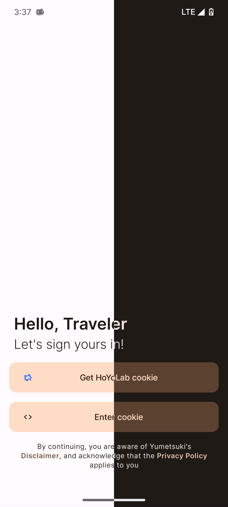
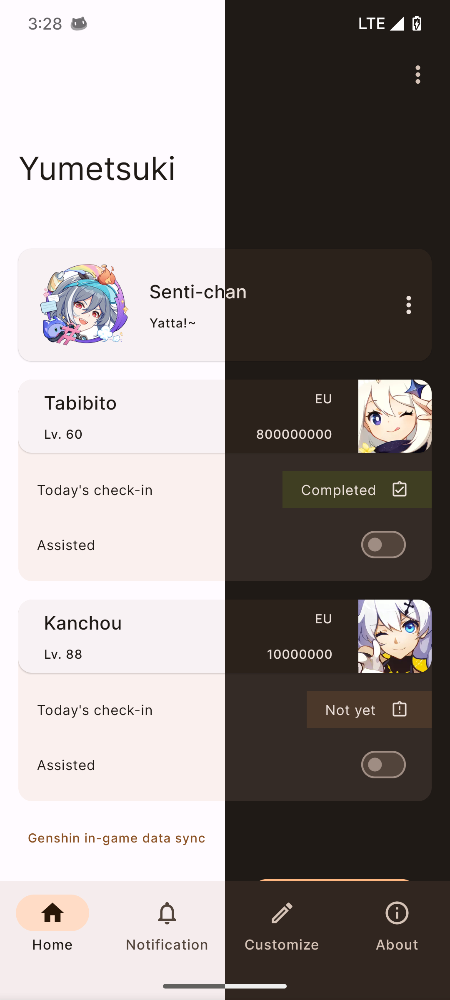
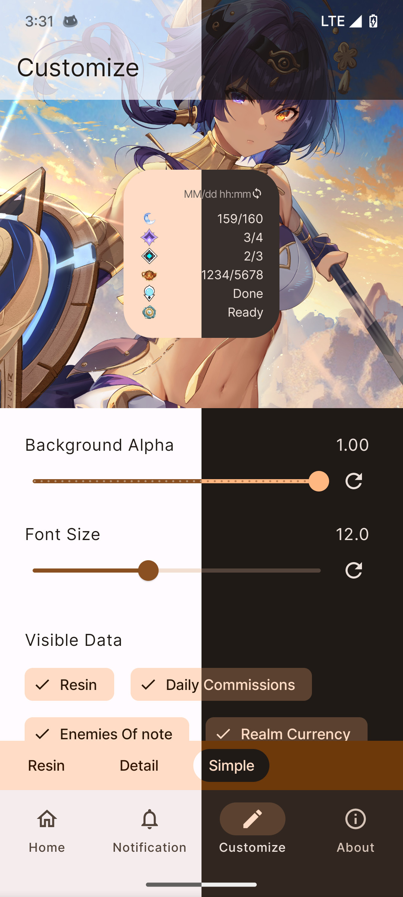

# yumetsuki

> An utility app for monitoring in-game status on Genshin Impact like resin status, realm currency,
> expedition, daily commission status, etc.

### Disclaimer

This project is primarily for learning purposes, to try Jetpack Compose and learn how to do things
in compose-way. More at [disclaimer.md](disclaimer.md).

## Tech stack 🛠

- [Kotlin](https://kotlinlang.org/) - First class programming language for Android development.
    - [Coroutines](https://kotlinlang.org/docs/reference/coroutines-overview.html) - Handling async
      operations
    - [Flow](https://kotlinlang.org/docs/flow.html) - Going reactive
- [Android Architecture Components](https://developer.android.com/topic/libraries/architecture)
    - [ViewModel](https://developer.android.com/topic/libraries/architecture/viewmodel)
    - [DataStore](https://developer.android.com/topic/libraries/architecture/datastore) - For
      persisting typed objects
    - [Room](https://developer.android.com/training/data-storage/room) - For persisting the data
- [Retrofit](https://square.github.io/retrofit/)
- [Moshi](https://github.com/square/moshi) - For parsing API and de/serialization for DataStore
- [Jetpack Compose](https://developer.android.com/jetpack/compose) - Android’s recommended toolkit
  for building native UI.
- [Navigation Component](https://developer.android.com/guide/navigation/navigation-getting-started)
    - [Navigating with Compose](https://developer.android.com/jetpack/compose/navigation)
- [Dependency Injection](https://developer.android.com/training/dependency-injection)
    - [Dagger-Hilt](https://dagger.dev/hilt/)
    - [Hilt-ViewModel](https://developer.android.com/training/dependency-injection/hilt-jetpack)
- [Accompanist](https://chrisbanes.github.io/accompanist/) - Various experimental components for
  Jetpack Compose.
- And many more...

## Screenshots ✨

    
    
    

## Credits

Thanks to [danggai](https://github.com/danggai) as this app is based
on [Genshin Resin Widget](https://github.com/danggai/android_genshin_resin_widget) app.

## License

Yumetsuki code is licensed under [MIT License](LICENSE.md).
